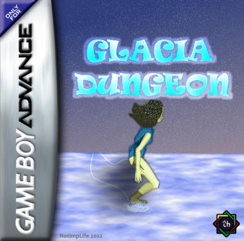

<p align="center">
    </img>
</p>

# Glacia Dungeon


</img>
</img>
</img>
</img>
</img>
</img>
</img>
</img>
</img>
</img>
</img>

_Game started as a project for Retro Platform Jam #5 as well as GBAJam 2022._

## The idea

This project is a direct consequence of the manifest game [Notebook Adventure](https://github.com/NotImplementedLife/NotebookAdventure), optimizing some of its workings and providing enhanced features. If I were to justify a period of about 5 months of not publishing
a single game, the reason is that meanwhile I started work on a GBA engine that would fit my homebrew activity needs. Glacia Dungeon is one of the first two games based on my Astralbre engine. Its twin brother is my yet-to-be-completed game [Bugtris](https://github.com/NotImplementedLife/Bugtris). While in Bugtris I focused on more technical details related to dialogs, events and scene connections, for Glacia DungeonI decided to improve my tile streaming method, play a lot more with the hardware and use mosaic, object rotations and others. 

<p align="center">
    </img>
</p>

Glacia Dungeon was lucky to receive a more careful attention to gameplay and design that I use to give, mainly because I got extremely excited to work on this game up to the point that I was willing to sacrifice my school, sleep and meals just to see how my little gem was going to evolve. And certainly, I'm not dissatisfied with the result. I made <s>wise</s> usage of the RNG functions (at one point defined my own one), added enemies with their own spawn and moving rules, ambient touches, edited my backgrounds in the last two days before deadline because I got
inspired and they looked damn cool. As usual, I tried to make my graphics look as good as possible to my untrained eye, and did monkey typing when it comes to soundtracks (sorry for your hears...). 

There were also hard times, too... I fought with completely unexplainable bugs, I swore I would force myself to live in a cave when I got an "invalid memory write to 0x(an obscenely strange address)". But I also learned about the thing that is most obvious in stackoverflow.com's name but can subtly slide from your attention: the stack _can_ overflow. And if you are unaware about that, it _will_ overflow. And if you're on the Game Boy, it wouldn't even care. It will just break the code and scream its pain through pixels. When I was able to understand and conquer that fact, I almost felt I had God's powers in my own hands. An absurd metaphor for an equally absurd sentiment. No more fear, no more frustration, light finally shed above me and my shitty code and I finally can admire its beauty and value most of its full potential. 

I also timidly tried to tame something that haunted me for years: the dark realm of Makefile. Even though I wouldn't be able to write one from scratch, editing an existing one to improve my workflow is what I consider a crucial progress. That's how Astralfonts were born (tables of 8x8/8x16/16x16 character bitmaps, included in Astralbrew library) and the Python tools to help with small tasks like converting data to source code in a specific manner.

Overall, I exceeded my own expectations on what I can do on the GBA. To some of the readers who may think I get too pumped up on a work which is too amatorish and/or mediocre, I get your point. I know, my knowledge is limited and I'm here to learn at my own pace, but at least I'm a bit better than yesterday, and that's a thoughtful accomplishment.

## How to build

You need a compiled Astralbrew library distribution. As the engine's source is not yet ready to be published, I attached a working debug library version to each of the game releases. Extract the `Astralbrew` folder from the zip file to a location on your computer (make sure the path doesn't contain any spaces, otherwise devkitPro's tools would complain about this).

Now you need to put the path to the engine into an environment variable

`set ASTRALBREW=x:/path/to/Astralbrew`

Now you can finally build it.

```
git clone https://github.com/NotImplementedLife/GlaciaDungeon
cd GlaciaDungeon
make -f Makefile
```

The code compiles with the latest version of devkitPro toolchains, and makes use of C++17 features. If you have any trouble compiling it, please don't hesistate to contact me. I don't guarantee I would be able to detect the issues and solve them in all cases, but at least I could try to help. (I had nightmares myself to make it work on my own PC after I reinstalled Windows so yeah =)) ).

## Credits

- [foopod](https://github.com/foopod) & [exelotl](https://github.com/exelotl) for the GBAJam2022 logo
- GBAJam2022 organisers and the whole GBA and other retro consoles dev communities
- [ModArchive](modarchive.org) for the instruments I used in the soundtracks
- libgba for the GBA development tools

## External links

- https://notimplementedlife.itch.io/glaciadungeon